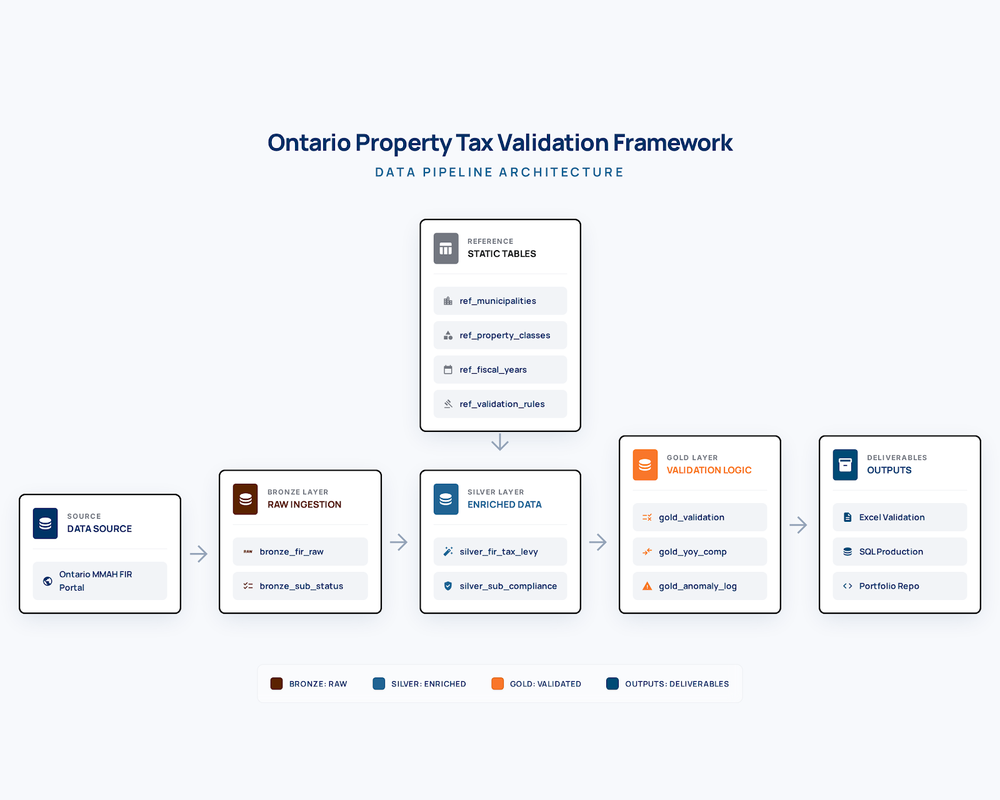
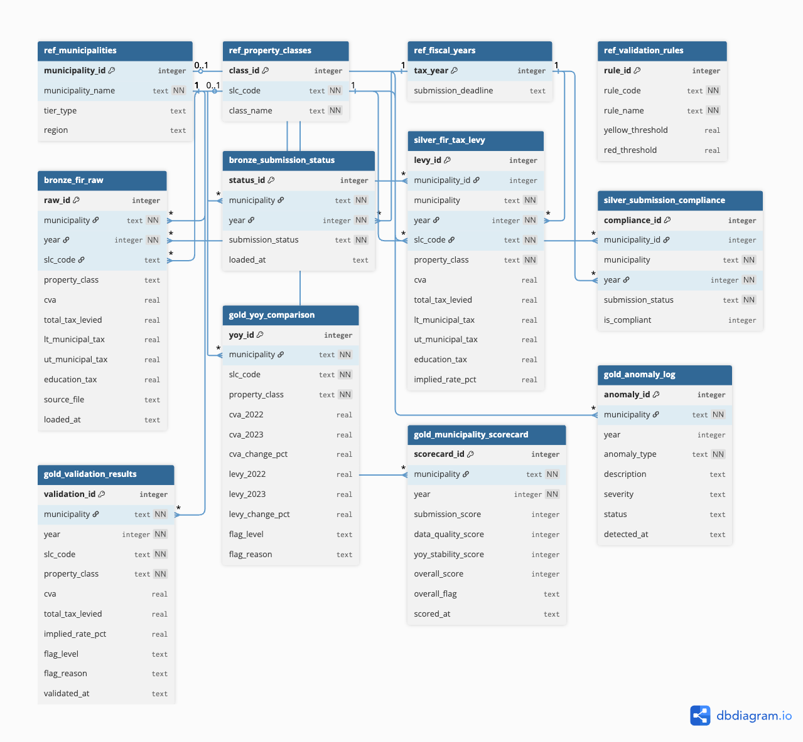

# Ontario Property Tax Data Quality & Validation Framework

## The Problem

The Financial Information Return is one of Ontario's most comprehensive municipal data collection tools. Every year, 444 municipalities submit hundreds of data points each to the Ministry of Municipal Affairs and Housing, covering assessed values, tax levies, and property class breakdowns across residential, commercial, industrial, and farmland categories. The volume is significant. The infrastructure to validate it at scale is still being developed.

I came across the FIR dataset while exploring Ontario's open municipal finance data and was struck by the opportunity it presented for applied data governance work. Each submission contains assessed values, tax levies, and property class breakdowns that are only meaningful when validated against prior years and cross-referenced across municipalities.

The Ministry of Finance is currently developing an in-house data quality and validation function for property tax data. This project was built to explore what that validation framework could look like in practice, using real FIR submissions, real municipalities, and real anomalies that emerged from the data.

---

## What This Project Does

I pulled Schedule 26A data from the MMAH FIR portal for 10 Ontario municipalities across 2022 and 2023. Schedule 26A contains the tax levy breakdown by property class -- residential, commercial, industrial, farmland, pipelines -- along with the Current Value Assessment (CVA) that underlies each levy.

From that raw data, I built a three-layer validation pipeline:

**Bronze** -- raw FIR data as extracted, no transformations. Every number exactly as the municipality reported it.

**Silver** -- cleaned and enriched. Joined with reference tables, implied tax rates calculated (Total Tax / CVA x 100), submission compliance flagged.

**Gold** -- the analytical output. Validation flags, year-over-year comparisons, municipality scorecards, and an anomaly log with severity ratings.

The whole thing outputs to an Excel validation workbook -- because that is the tool the Ministry team actually uses.

---

## What I Found

**Hamilton 2023 -- CRITICAL**
Hamilton submitted their 2022 FIR with a total levy of $1,208,923,947. Their 2023 submission is missing from the portal entirely. A municipality that collected over $1.2 billion in property taxes last year has not reported to the province. This is the kind of gap a data quality framework should catch automatically.

**Markham Large Industrial -- HIGH**
Large industrial levy jumped 90.1% year over year -- from $834,702 in 2022 to $1,586,795 in 2023. This could be legitimate new construction or it could be a reporting error. Either way, it needs a conversation.

**London Large Industrial -- HIGH**
48.5% increase year over year across multiple property classes. London also showed elevated commercial and industrial rates relative to comparable municipalities.

**Windsor Residential Rate -- MEDIUM**
Windsor's residential implied rate sits at 1.94% -- the highest among all 10 municipalities reviewed. Toronto is at 0.67%, Markham at 0.66%. Windsor property owners are paying nearly 3x the residential rate of GTA municipalities. This is not necessarily wrong, but it is an outlier worth documenting.

**Mississauga Managed Forest -- MEDIUM**
Managed forest levy dropped 20.8% year over year. The most likely explanation is property reclassification, but that should be verified against MPAC assessment data.

---

## Compliance Summary

| Year | Municipalities | Submitted | Missing | Compliance |
|------|---------------|-----------|---------|------------|
| 2022 | 10 | 10 | 0 | 100% |
| 2023 | 10 | 9 | 1 | 90% |

---

## Municipality Scorecard (2023)

Scoring methodology: Submission (40 pts) + Data Quality (40 pts) + YoY Stability (20 pts)

| Municipality | Score | Flag |
|---|---|---|
| Toronto | 90/100 | GREEN |
| Mississauga | 80/100 | GREEN |
| Ottawa | 80/100 | GREEN |
| Vaughan | 80/100 | GREEN |
| Brampton | 80/100 | GREEN |
| Kitchener | 80/100 | GREEN |
| Windsor | 80/100 | GREEN |
| London | 80/100 | GREEN |
| Markham | 80/100 | GREEN |
| Hamilton | 0/100 | RED |

---

## Tech Stack

| Tool | Purpose |
|---|---|
| Python + openpyxl | Extract Schedule 26A data from FIR Excel files |
| pandas | CSV processing and bronze layer loading |
| SQLite | Local database -- medallion architecture |
| DBeaver | Database management and SQL execution |
| openpyxl | Generate Excel validation workbook |
| dbdiagram.io | ERD schema design |

**Note on SQLite vs SQL Server:** The Ministry of Finance uses SQL Server. This project uses SQLite for local development. The schema design, SQL queries, JOIN logic, CASE WHEN validation flags, and view structures are all directly compatible with SQL Server. The database engine is different; the approach is the same.

---

## Project Structure

```
ontario-property-tax-validation/
├── README.md
├── docs/
│   ├── erd_schema.png
│   └── pipeline_diagram.png
├── data/
│   ├── raw/
│   │   ├── 2022/          -- FIR Excel files from MMAH portal
│   │   └── 2023/          -- FIR Excel files from MMAH portal
│   ├── processed/
│   │   ├── fir_data_2022.csv
│   │   └── fir_data_2023.csv
│   └── property_tax_validation.db
├── sql/
│   ├── 01_reference_tables.sql
│   ├── 02_bronze.sql
│   ├── 03_silver.sql
│   ├── 04_gold.sql
│   └── 05_views.sql
├── python/
│   ├── extract_fir.py
│   ├── load_bronze_layer_csv_files.py
│   └── make_excel.py
└── excel/
    └── property_tax_validation.xlsx
```

---

## Data Source

All FIR data downloaded from the Ontario MMAH FIR portal:
efis.fma.csc.gov.on.ca/fir

Schedule 26A -- Taxation and Payment-in-Lieu Summary -- contains the tax levy breakdown by Standard Line Code (SLC) for each property class.

**Municipalities covered:** Toronto, Mississauga, Ottawa, Brampton, Vaughan, Kitchener, Windsor, London, Markham, Hamilton

**Years:** 2022, 2023

## Pipeline Architecture



---

## Database Schema (ERD)



**Note:** Hamilton's 2023 FIR was not available on the MMAH portal as of the date this analysis was conducted. This is documented as a CRITICAL anomaly in the validation framework.

---

## Why This Matters

As municipal data collection scales, so does the complexity of validating it. The FIR is a rich dataset covering tax levies, assessed values, and property class breakdowns across hundreds of municipalities. Deriving insight from it requires more than collecting submissions. It requires a structured process for comparing data across years, flagging unusual patterns, and tracking whether those patterns reflect legitimate changes or reporting gaps.

This project demonstrates one approach to that process: raw data ingested without modification at the bronze layer, enriched and joined with reference data at the silver layer, and validated with explicit rules and severity ratings at the gold layer. Validation thresholds are stored in a reference table rather than hardcoded, so they can be updated as policy or methodology evolves without touching the underlying pipeline.

The anomalies surfaced here are real. Hamilton's missing 2023 submission, Markham's 90% industrial levy spike, Windsor's outlier residential rate: each of these emerged directly from the data. A framework like this, running on a regular cadence, gives analysts a starting point for those conversations rather than requiring them to find the gaps manually.

---

## Author

**Sofia Ahmed**
Data Analyst, Mississauga, Ontario

Post-Graduate Certificate in Data Analytics, Humber College
Azure DP-203 Certified, Databricks Certified, AWS Certified
Master of Engineering, Chemical Engineering

[LinkedIn](https://www.linkedin.com/in/sofiaanjum) | [GitHub](https://github.com/sofiaanhmed15)

---

## Running the Project

```bash
# Clone and set up
git clone https://github.com/sofiaahmed15/ontario-property-tax-validation
cd ontario-property-tax-validation
python3 -m venv venv
source venv/bin/activate
pip install openpyxl pandas

# Download FIR files from MMAH portal into data/raw/2022/ and data/raw/2023/

# Extract Schedule 26A data
python python/extract_fir.py

# Load bronze layer
python python/load_bronze_layer_csv_files.py

# Run SQL scripts in DBeaver (in order 01 through 05)

# Generate Excel workbook
python python/make_excel.py
```